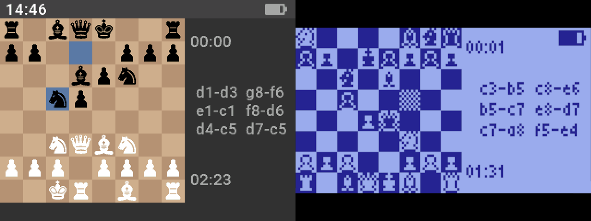

## Overview

mcu-max is an MCU-optimized C-language chess game engine based on [micro-Max][micro-max-link].

mcu-max comes with an Arduino serial port example, and a UCI chess interface example for testing mcu-max from UCI-compatible chess game GUIs.

When running on devices with little memory, you might want to adjust the max depth value to avoid stack overflows.

Download the [Rad Pro simulator](https://www.github.com/gissio/radpro/releases) to try mcu-max.

## Features

* Configurable hashing.
* Configurable node limit.
* Configurable max depth.
* Valid move Listing.
* Best-move search termination.

## Terms of use

mcu-max is freely available and distributed under the MIT license.

[micro-max-link]: https://home.hccnet.nl/h.g.muller/max-src2.html
